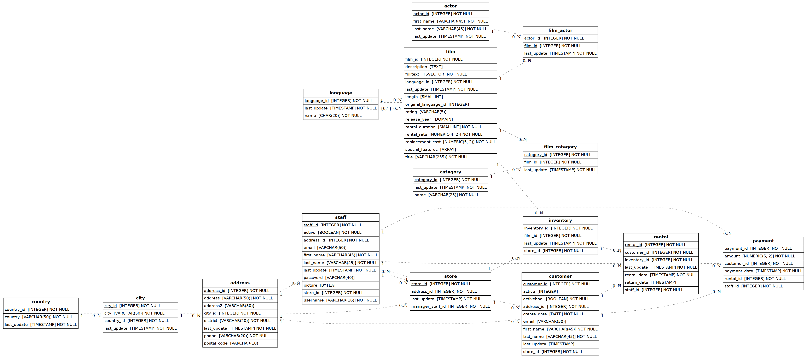

# DataProject: Lógica de Consultas SQL

Proyecto del módulo de SQL en el que se trabaja con **Sakila**, la base de datos ficticia de una tienda de alquiler de películas, para practicar consultas de distinta complejidad: filtrado, agregación, joins, subconsultas, vistas y tablas temporales.

## Contenido del repositorio

| Archivo | Descripción |
|---|---|
| `README.md` | Este documento: pasos seguidos e informe de análisis |
| `esquema_bbdd.png` | Diagrama entidad-relación (ER) de la base de datos proporcionada |
| `consultas.sql` | Las 64 consultas resueltas, cada una identificada con su número y enunciado como comentario |

## Base de datos utilizada

Sakila (aquí `shakila`), motor **PostgreSQL**, cargada a partir del script `BBDD_Proyecto_shakila_sinuser.sql` proporcionado en el enunciado. Contiene 15 tablas:

`actor`, `address`, `category`, `city`, `country`, `customer`, `film`, `film_actor`, `film_category`, `inventory`, `language`, `payment`, `rental`, `staff`, `store`.

Volumen de datos: 200 actores, 1.000 películas, 16 categorías, 599 clientes, 4.581 ítems de inventario, 16.044 alquileres y 16.049 pagos, repartidos en 2 tiendas.

## Pasos seguidos durante el proyecto

1. **Descarga del enunciado y de la base de datos.** Se descargaron el PDF con los 64 ejercicios y el script `BBDD_Proyecto_shakila_sinuser.sql` (dump de PostgreSQL) desde los enlaces proporcionados.
2. **Instalación del motor de base de datos.** Se instaló PostgreSQL y se creó una base de datos vacía llamada `sakila`.
3. **Importación del esquema y los datos.** Se ejecutó el script completo `BBDD_Proyecto_shakila_sinuser.sql` sobre la base de datos `sakila`, lo que creó las 15 tablas, sus relaciones (claves foráneas), tipos personalizados (`mpaa_rating`, `year`) y cargó todos los registros.
4. **Conexión y trabajo en DBeaver.** Se creó una conexión a `localhost:5432` en DBeaver y se comprobó que las tablas contenían los datos esperados.
5. **Generación del esquema visual.** Se generó el diagrama entidad-relación (`esquema_bbdd.png`) a partir de la base de datos importada, mostrando las 15 tablas y sus relaciones (claves primarias/foráneas).
6. **Resolución de las 64 consultas.** Se escribieron y ejecutaron una a una las consultas pedidas en el enunciado, adaptadas a la sintaxis de PostgreSQL (por ejemplo, `TO_CHAR` en vez de `DATE_FORMAT`, resta de fechas en vez de `DATEDIFF`, `FULL OUTER JOIN` nativo). Cada consulta se verificó contra la base de datos real para confirmar que se ejecuta sin errores y devuelve resultados coherentes.
7. **Análisis de resultados.** Con los resultados obtenidos se redactó el informe que aparece más abajo.

## Esquema de la base de datos

## Informe de análisis

A partir de los resultados obtenidos al ejecutar las consultas del archivo `consultas.sql` sobre los datos reales, se extraen las siguientes conclusiones:

**Facturación y periodo de actividad**
- La empresa ha generado un total de **67.416,51 €** en concepto de alquileres (consulta 15).
- Los alquileres registrados abarcan de **mayo de 2005 a febrero de 2006**, con un pico muy marcado en julio de 2005 (6.709 alquileres) y agosto de 2005 (5.686 alquileres), frente a los 182 de febrero de 2006 (consulta 25). Esto sugiere que el grueso de la actividad se concentra en el verano de 2005, posiblemente por ser el periodo con más datos capturados en el dataset.
- El importe medio por pago es de **4,20 €**, con una desviación estándar de 2,36 € y una varianza de 5,58 (consulta 26), lo que indica que la mayoría de los pagos se mueven en un rango relativamente estrecho alrededor de la media, sin grandes outliers.

**Catálogo de películas**
- Las 1.000 películas del catálogo se estrenaron todas en el año **2006** (consulta 62), lo que indica que es un catálogo "de lanzamiento" simulado, no una colección histórica real.
- La clasificación por edades más común es **PG-13** (223 películas), seguida de NC-17 (210), R (195), PG (194) y G (178) (consulta 7); están bastante equilibradas entre sí.
- La duración de las películas oscila entre **46 y 185 minutos** (consulta 10).
- Por categoría, las películas más largas de media son **Sports** (128,2 min) y **Games** (127,8 min), mientras que las más cortas no superan los 110 minutos de promedio (consulta 20).

**Comportamiento de alquiler por categoría**
- La categoría con más alquileres totales es **Sports** (1.179), seguida de cerca por Animation (1.166), Action (1.112) y Sci-Fi (1.101) (consulta 61). En el otro extremo, Music (830) y Travel (837) son las menos alquiladas.
- Esto indica que, aunque todas las categorías tienen un volumen de alquiler parecido (no hay una categoría dominante de forma aplastante), las de acción/aventura y animación destacan ligeramente sobre el resto.

**Clientes**
- Los clientes que más han gastado con la empresa son **Karl Seal** (221,55 €) y **Eleanor Hunt** (216,54 €), seguidos de Clara Shaw, Rhonda Kennedy y Marion Snyder, todos por encima de 190 € (consulta 34).
- La base de clientes es de 599 personas repartidas entre las 2 tiendas de la empresa.

**Actores**
- Hay 200 actores en la base de datos (consulta 38).
- El nombre de pila más repetido entre los actores es **Penelope**, con 4 actores que lo comparten (consulta 41).
- Solo 2 actores han participado en más de 40 películas: los actores con `actor_id` 107 (42 películas) y 102 (41 películas) (consulta 28), lo que muestra que la gran mayoría del reparto participa en un número mucho más moderado de producciones.

**Sobre la consulta 44 (CROSS JOIN film × category)**
El `CROSS JOIN` entre `film` y `category` no aporta valor analítico por sí mismo: genera el producto cartesiano de 1.000 películas × 16 categorías (16.000 filas), combinando cada película con TODAS las categorías existan o no relación real entre ellas. Para obtener la categoría real de cada película es necesario pasar por la tabla intermedia `film_category`, tal como se hace en el resto de consultas relacionadas con categorías. El `CROSS JOIN` solo tiene utilidad didáctica para entender el concepto de producto cartesiano.

## Notas técnicas

- Todas las consultas se probaron contra la base de datos real y se confirmó que se ejecutan sin errores en PostgreSQL 16.
- Se usó `TO_CHAR(fecha, 'YYYY-MM')` en lugar de `DATE_FORMAT` (propio de MySQL) y resta de fechas (`fecha1::date - fecha2::date`) en lugar de `DATEDIFF`.
- `VARIANCE` y `STDDEV` funcionan de forma nativa en PostgreSQL como alias de `VAR_SAMP` y `STDDEV_SAMP`.
- PostgreSQL soporta `FULL OUTER JOIN` de forma nativa, por lo que no fue necesario emularlo con `UNION` de `LEFT JOIN` y `RIGHT JOIN`.
